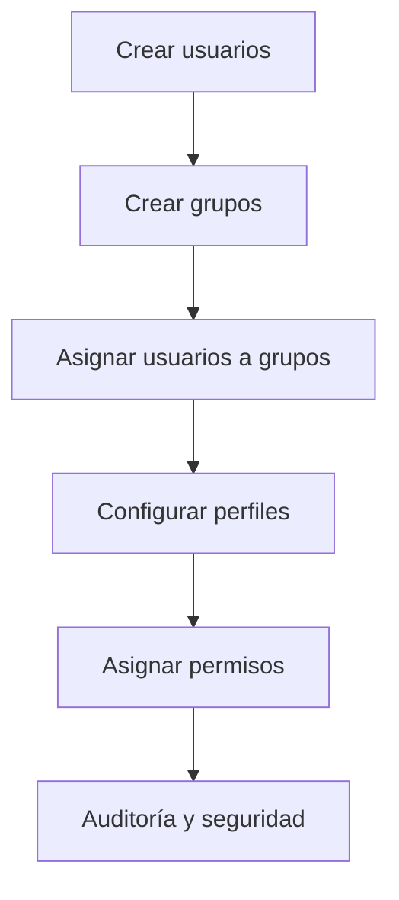

# Proyecto: Gestión de Usuarios y Grupos en el Dominio

## Hotel Gran Descanso Plus – RA2

---

## 🎯 Objetivo General

Implementar una **gestión completa de identidades** en el dominio del *Hotel Gran Descanso Plus*, asegurando seguridad, eficiencia operativa y cumplimiento del **Resultado de Aprendizaje RA2** mediante la correcta administración de **usuarios, grupos, equipos y perfiles**.

---

# 🧩 Relación con Resultados de Aprendizaje

**RA2.** Gestiona usuarios y grupos de sistemas operativos en red, interpretando especificaciones y aplicando herramientas del sistema.

Se cubren los criterios **CE a → CE i** a través de las tareas T1–T9.

---

# 🏨 Contexto del Proyecto

El hotel necesita una estructura de dominio avanzada para gestionar el acceso diferenciado de:

* Recepción
* Administración
* Limpieza
* Cocina
* Mantenimiento
* Dirección

La solución se basa en **Active Directory** como servicio de directorio central.

---

# 🧑‍💼 Tarea 1: Creación de Cuentas Operativas (CE a)

## Objetivo

Configurar y gestionar cuentas de usuario para empleados temporales y operativos.

## Pasos

1. Abrir **Usuarios y equipos de Active Directory**.
2. Navegar a la OU correspondiente (ej. `OU_Recepción`).
3. Clic derecho → **Nuevo → Usuario**.
4. Crear usuarios (ejemplo):

```
recep01_temp
recep02_temp
camarero01_temp
```

5. Configurar contraseña inicial.
6. En **Propiedades → Cuenta**:

   * Definir **caducidad de contraseña**.
   * Configurar **horas permitidas de inicio de sesión**.

✅ Criterio cubierto: CE a

---

# 🖥️ Tarea 2: Definición de Entornos de Trabajo (CE b)

## Objetivo

Gestionar perfiles de usuario según el rol.

### Perfil Controller (Finanzas)

1. Usuario: `controller_finanzas`.
2. Acceso restringido a carpetas financieras.
3. Escritorio con:

   * Software contable
   * Sin acceso a PMS

### Perfil Recepción

1. Usuarios de recepción.
2. Configurar **script de inicio** o GPO:

   * PMS como aplicación predeterminada.

✅ Criterio cubierto: CE b

---

# 🖨️ Tarea 3: Registro de Dispositivos (CE c)

## Objetivo

Gestionar cuentas de equipo del dominio.

## Pasos

1. Unir equipos al dominio:

```
PC-TPV-01
PC-TPV-02
PC-BUSINESS-01
```

2. Verificar creación automática de cuentas de equipo.
3. Mover equipos a OUs específicas:

   * `OU_TPV`
   * `OU_BusinessCenter`

✅ Criterio cubierto: CE c

---

# 🧱 Tarea 4: Diseño de la Estructura de Acceso (CE d)

## Objetivo

Definir correctamente tipos y ámbitos de grupos.

## Diseño

* **Grupos de seguridad** (acceso a recursos)
* Ámbito:

  * Global → Usuarios
  * Local de dominio → Permisos

Ejemplo:

```
GG_Recepción
DL_Acceso_PMS
```

✅ Criterio cubierto: CE d

---

# 👥 Tarea 5: Implementación de Grupos Funcionales (CE e)

## Objetivo

Crear y gestionar grupos de seguridad.

## Pasos

1. Crear grupos:

```
GR_Recepción_Diurna
GR_Administración_TI
GR_Mantenimiento
```

2. Tipo: Seguridad
3. Ámbito: Global

✅ Criterio cubierto: CE e

---

# 🔑 Tarea 6: Asignación de Permisos (CE f)

## Objetivo

Gestionar la pertenencia de usuarios a grupos.

## Pasos

1. Añadir usuarios a grupos según rol.
2. Ejemplo:

```
recep01_temp → GR_Recepción_Diurna
admin01 → GR_Administración_TI
```

3. Asignar permisos NTFS y recursos compartidos a grupos.

✅ Criterio cubierto: CE f

---

# 🔍 Tarea 7: Auditoría de Seguridad Inicial (CE g)

## Objetivo

Identificar usuarios y grupos especiales.

## Pasos

1. Revisar cuentas:

   * Administrator → Renombrar
   * Guest → Deshabilitar
2. Revisar grupos:

   * Domain Admins
   * Enterprise Admins
3. Documentar estado de seguridad.

✅ Criterio cubierto: CE g

---

# 🚀 Tarea 8: Movilidad y Despliegue de Perfiles (CE h)

## Objetivo

Planificar perfiles móviles.

## Pasos

1. Crear recurso compartido:

```
\\SERVER\PerfilesMoviles
```

2. Configurar perfiles móviles para:

   * Dirección
   * Mantenimiento
3. Definir rutas en propiedades del usuario.

✅ Criterio cubierto: CE h

---

# 🛠️ Tarea 9: Aplicación de Herramientas de Administración (CE i)

## Objetivo

Utilizar herramientas del sistema operativo.

## Herramientas usadas

* Usuarios y equipos de Active Directory
* Centro administrativo de AD
* GPO
* PowerShell (opcional):

```powershell
New-ADUser
Add-ADGroupMember
```

✅ Criterio cubierto: CE i

---

# 📊 Diagrama de Flujo General



---

# ✅ Síntesis Final

Este proyecto cumple íntegramente el **RA2**, demostrando:

* Gestión avanzada de usuarios
* Diseño correcto de grupos
* Seguridad y movilidad
* Uso competente de herramientas de administración

📁 Documento listo para **GitHub (.md)**
